# rest_server_client

[](https://github.com/nomcom/cycle_meter/actions/workflows/build_android.yml)

[](https://github.com/nomcom/cycle_meter/actions/workflows/firebase-hosting-merge.yml)

## Firebase

https://firebase.google.com/docs/cli?authuser=0&hl=ja#windows-npm

1. Firebase CLI のインストール

```
npm install --save-dev firebase-tools
```

2. ログイン

```
npx firebase login

# チェック
npx firebase projects:list
```

認証画面が表示される。（Firebase CLI が Google アカウントへのアクセスをリクエストしています → 「許可」）

3. 初期化
   対象 PJ フォルダ内で以下を実行

```
npx firebase init
```

4. デプロイ

```
npx firebase deploy
```

# システム構成


